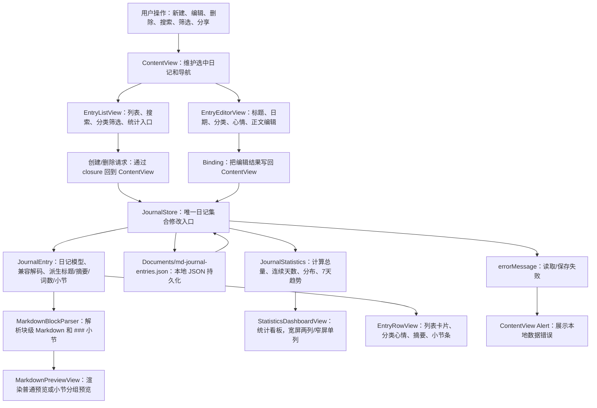
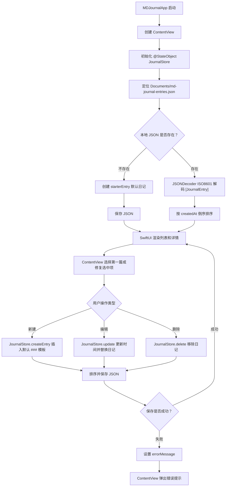
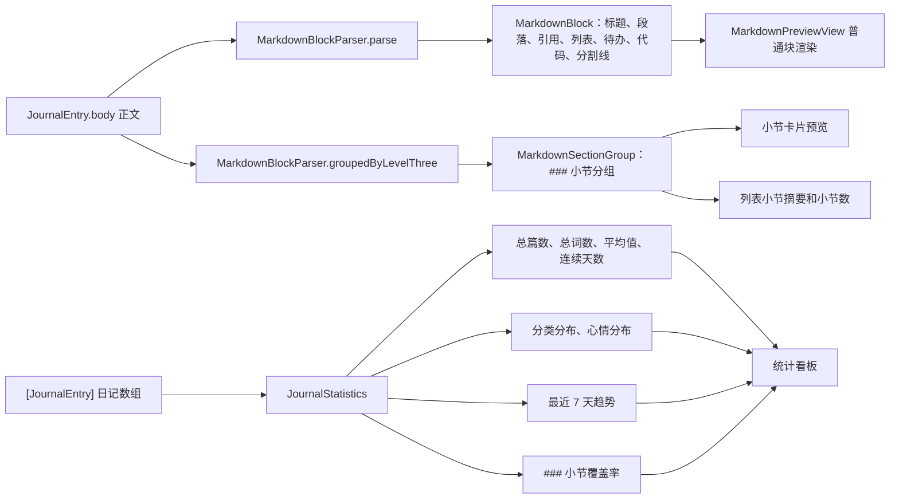
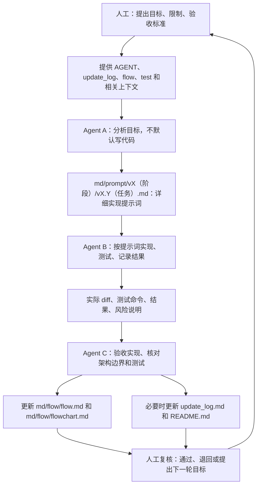

# 项目流程图

本文用 Mermaid 图描述 MD Journal 当前真实核心数据流、执行流和多 Agent 迭代流。每张图前都有通俗读图说明，方便人工快速判断系统怎么运转。

## 核心逻辑图

读图说明：从左到右看，用户在 SwiftUI 界面操作日记；状态变化进入 `JournalStore`；数据保存到本地 JSON；同一份日记数据再派生出列表、编辑器、预览和统计。图中每个节点都对应当前项目里的真实模块。

## 执行流图

读图说明：这张图按时间顺序展示 App 启动、加载、创建、编辑、保存和错误处理。重点看 `JournalStore`：它是读写本地数据的唯一中心。

## Markdown 与统计派生图

读图说明：正文和日记数组不会直接变成预览或统计，先经过解析器和统计器派生。后续改 Markdown 或统计口径时，应优先检查这张图对应的模块。

## Agent 迭代流程图

读图说明：人工先提出目标；Agent A 只负责分析并写给 Agent B 的实现提示词；Agent B 实现和测试；Agent C 验收并更新核心逻辑文档；人工复核后进入下一轮。

