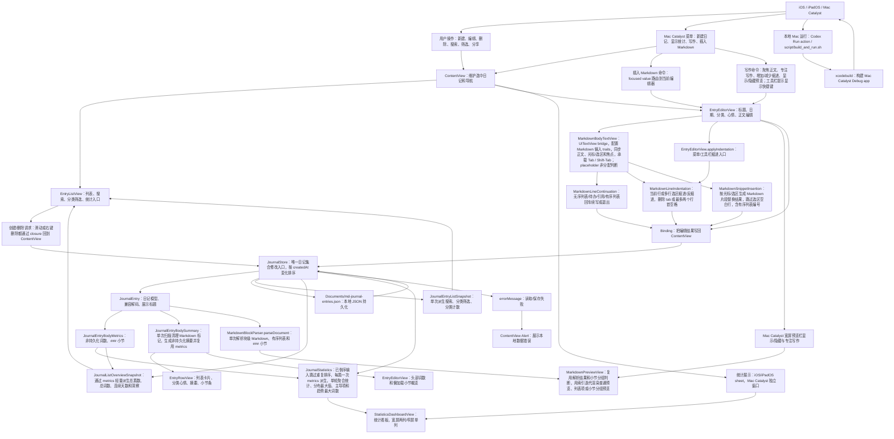
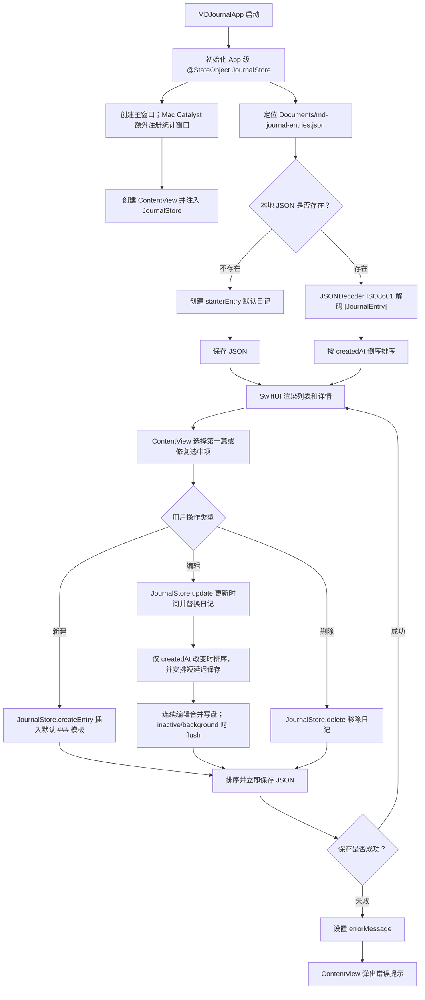
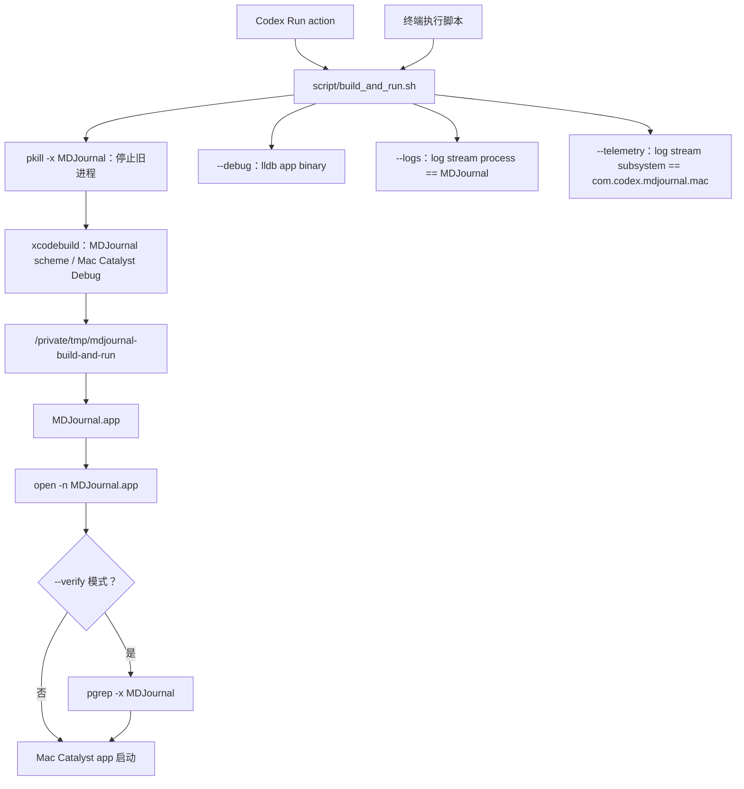
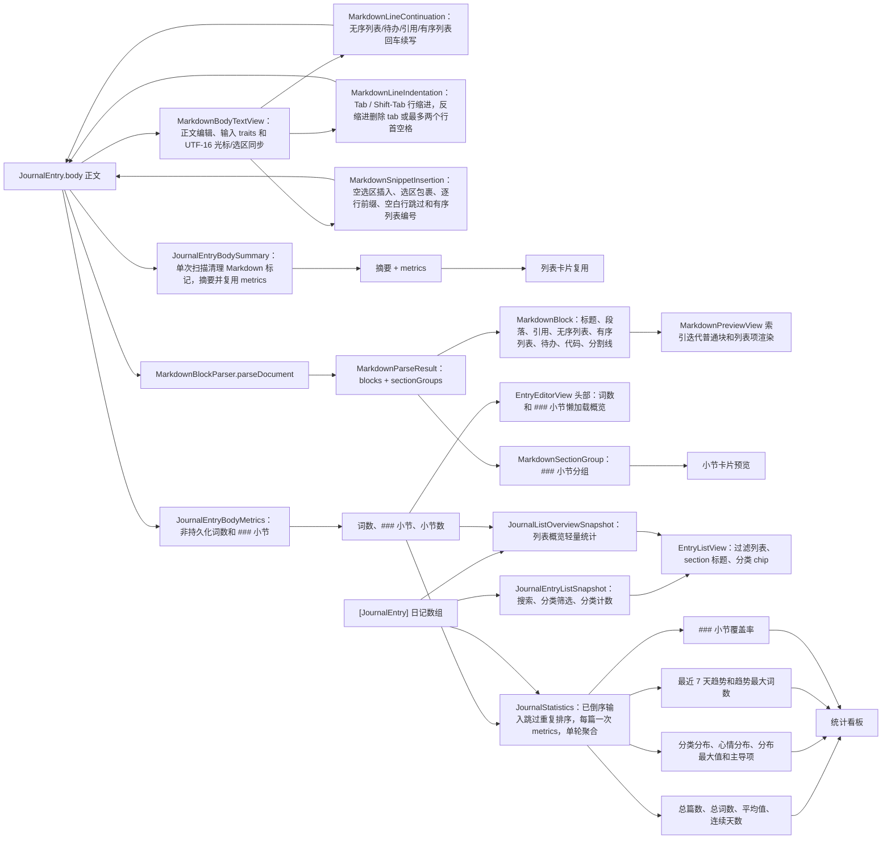
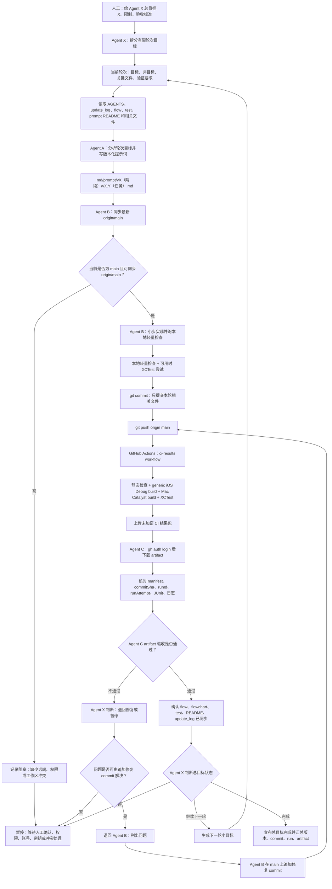
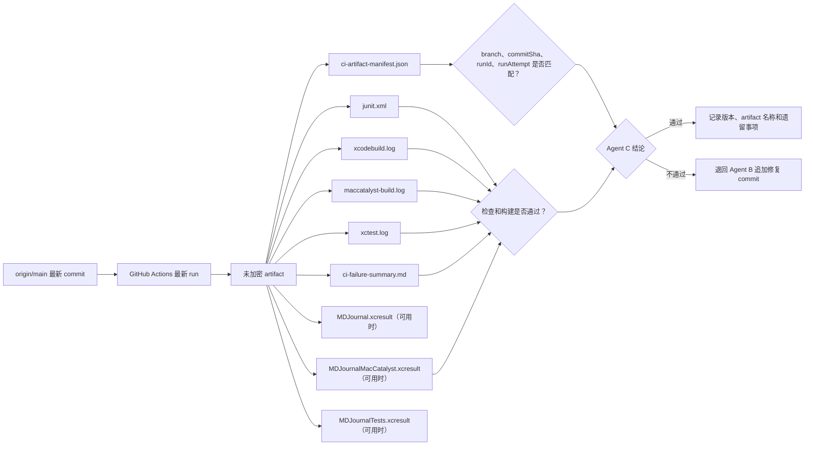

# 项目流程图

本文用 Mermaid 图描述 MD Journal 当前真实核心数据流、执行流和多 Agent 云端迭代流。每张图前都有通俗读图说明，方便人工快速判断系统怎么运转。

## 核心逻辑图

读图说明：从左到右看，用户在 SwiftUI 界面操作日记；状态变化进入 `JournalStore`；数据保存到本地 JSON；同一份日记数据再派生出列表、编辑器、预览和统计。图中每个节点都对应当前项目里的真实模块。

## 执行流图

读图说明：这张图按时间顺序展示 App 启动、加载、创建、编辑、保存和错误处理。重点看 `JournalStore`：它是读写本地数据的唯一中心。

## 本地 Mac 运行图

读图说明：这张图展示 Codex Run action 和 `script/build_and_run.sh` 如何构建并启动现有 Mac Catalyst app。它是本地运行辅助链路，不改变 app 内部数据流。

## Markdown 与统计派生图

读图说明：正文和日记数组不会直接变成预览或统计，先经过解析器和统计器派生。后续改 Markdown 或统计口径时，应优先检查这张图对应的模块。

## Agent X 主控云端迭代流程图

读图说明：人工用 `agentx:` 给出总目标 X；Agent X 只做主控调度，把总目标拆成有限小轮次。每轮仍由 Agent A 写提示词、Agent B 在 `main` 上实现并 push、GitHub Actions 生成未加密 artifact、Agent C 下载并核对 manifest、日志和摘要。Agent X 根据 Agent C 结果判断继续下一轮、退回修复、暂停等待人工或宣布总目标完成。

## CI 结果包验收图

读图说明：Agent C 不能只看文字汇报，必须下载最新 `origin/main` 对应 run 的 artifact，并核对结果包里的机器可读信息。

