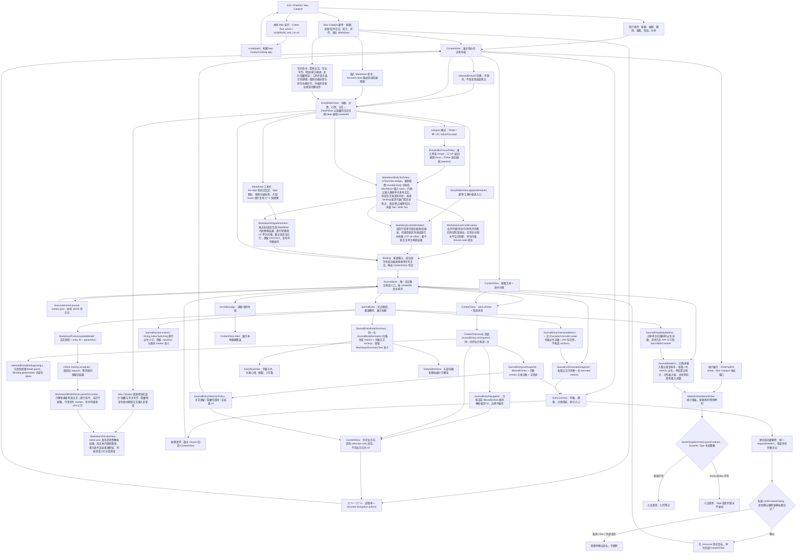
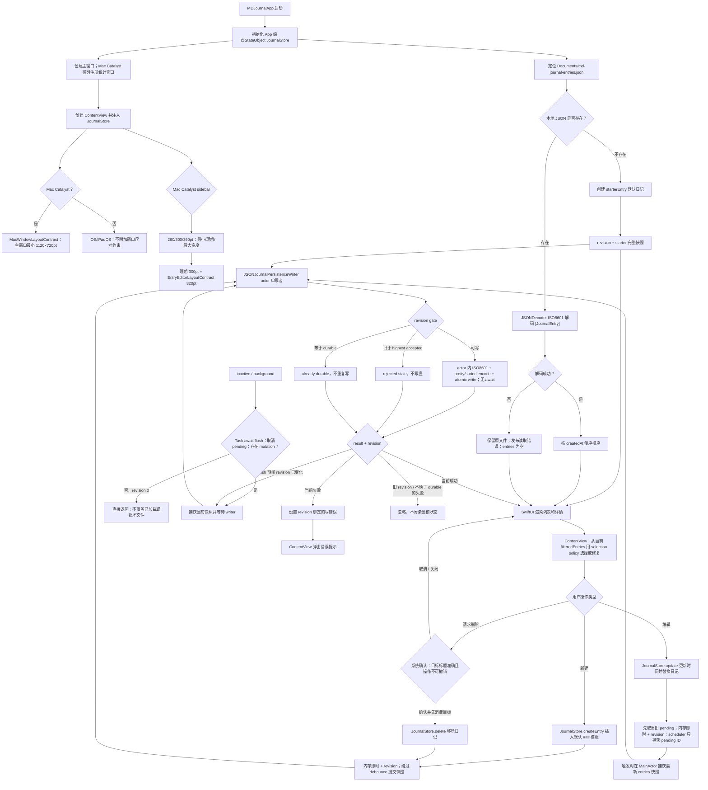
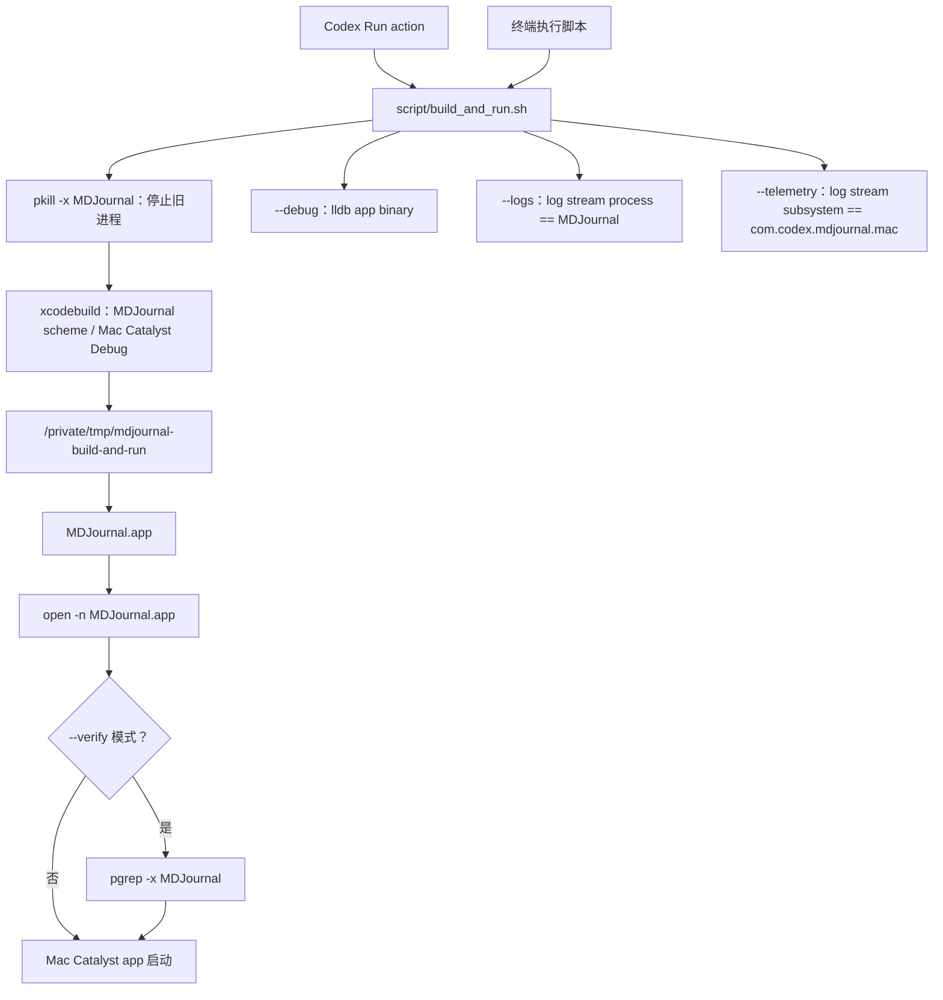
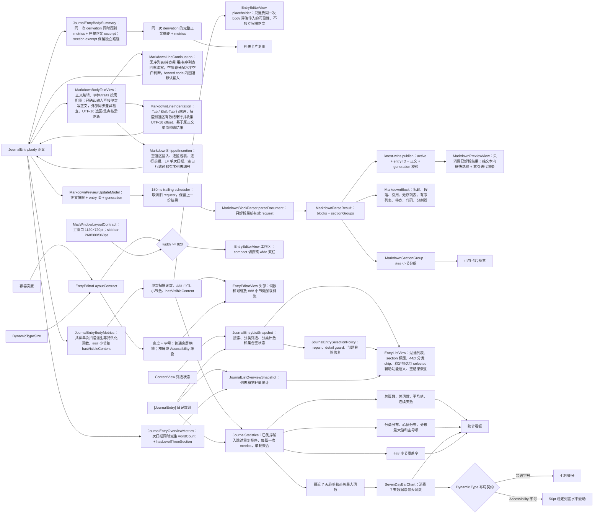
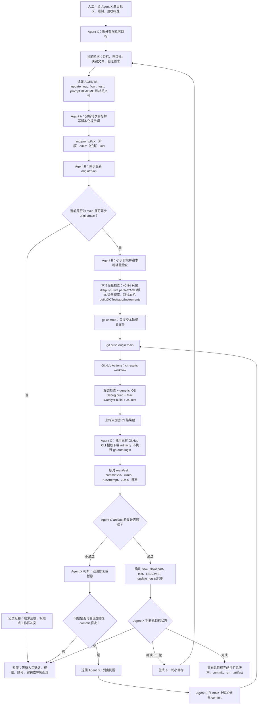
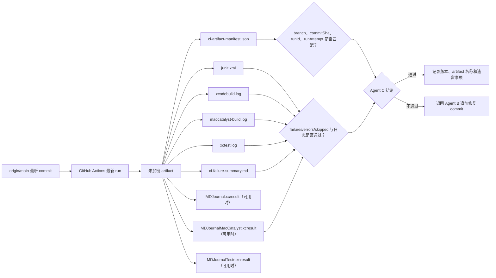

# 项目流程图

本文用 Mermaid 图描述 MD Journal 当前真实核心数据流、执行流和多 Agent 云端迭代流。每张图前都有通俗读图说明，方便人工快速判断系统怎么运转。

## 核心逻辑图

读图说明：从左到右看，用户在 SwiftUI 界面操作日记；状态变化进入 `JournalStore`；数据保存到本地 JSON；同一份日记数据再派生出列表、编辑器、预览和统计。`ContentView.body` 同一次评估只构造一份列表快照并显式分发给列表、detail guard 和导航 actions，事件路径再按需生成最新快照。图中每个节点都对应当前项目里的真实模块。

```mermaid
flowchart TD
  Platform["iOS / iPadOS / Mac Catalyst"] --> User["用户操作：新建、编辑、删除、搜索、筛选、分享"]
  Platform --> Menu["Mac Catalyst 菜单：新建、较新/较早日记、统计、写作、插入 Markdown"]
  Platform --> LocalRun["本地 Mac 运行：Codex Run action / script/build_and_run.sh"]
  LocalRun --> CatalystBuild["xcodebuild：构建 Mac Catalyst Debug app"]
  CatalystBuild --> Platform
  User --> CV["ContentView：维护选中日记和导航"]
  Menu --> CV
  Menu --> NavigationCommand["⌘⌥↑ / ⌘⌥↓：读取单一 focused navigation actions"]
  BodySnapshot --> NavigationRule["JournalEntryNavigation：只按当前 filteredEntries 顺序解析相邻 ID，边界不循环"]
  NavigationRule --> NavigationActions["ContentView：为可达方向提供 selection-only 闭包，不可达方向为 nil"]
  NavigationActions --> NavigationCommand
  NavigationCommand --> CV
  CV --> NavigationSelection["selectedEntryID 切换；不保存、不改变筛选或焦点"]
  NavigationSelection --> Editor
  CV --> List["EntryListView：列表、搜索、分类筛选、统计入口"]
  CV --> FilterState["ContentView：搜索文本 + 选中分类"]
  CV --> Editor["EntryEditorView：标题、分类、心情、正文；DatePicker 以隐藏的日记日期 label 编辑 createdAt"]
  Menu --> SnippetCommand["插入 Markdown 命令：focused value 路由到当前编辑器"]
  SnippetCommand --> Editor
  Menu --> WritingCommand["写作命令：聚焦正文、专注写作、增加/减少缩进、显示/隐藏预览；工具栏提示显示快捷键，辅助功能标签与命令标题对齐，并按状态表达预览切换动作"]
  WritingCommand --> Editor
  Editor --> CompactFocus["compact 模式：Picker / ⌘⌥P / editorFocused"]
  CompactFocus --> FocusPolicy["EntryEditorFocusPolicy：进入预览 resign；⌘⌥P 返回编辑 focus；Picker 选回编辑 preserve"]
  FocusPolicy --> BodyTextView
  Editor --> MarkdownToolbarNode["Markdown 工具栏：44×44pt 矩形交互区、16pt 图标、辅助功能标签，片段 hover 提示复用 ⌘⌥ 快捷键"]
  MarkdownToolbarNode --> SnippetInsertion
  Editor --> BodyTextView["MarkdownBodyTextView：UITextView bridge，按需配置 rounded body 字体和 Markdown 输入 traits；已确认输入直接单次发布正文，外部正文按差异同步，最新 binding/请求代数门控异步焦点，选区/焦点按需写回；承载 Tab / Shift-Tab"]
  Editor --> WritingIndent["EntryEditorView.applyIndentation：菜单/工具栏缩进入口"]
  WritingIndent --> LineIndentation
  BodyTextView --> LineContinuation["MarkdownLineContinuation：无序列表/待办/引用/有序列表回车续写或退出，空项非分配水平空白判断，单次扫描 fenced code 状态"]
  LineContinuation --> Binding
  BodyTextView --> LineIndentation["MarkdownLineIndentation：当前行或多行选区缩进/反缩进，扫描到选区有效结束行并收集 UTF-16 offset，基于原正文单次构造结果"]
  LineIndentation --> Binding
  BodyTextView --> SnippetInsertion["MarkdownSnippetInsertion：按光标/选区生成 Markdown 片段替换结果，逐行转换用 LF 单次扫描，跳过选区空白行，保留 CR/CRLF，含有序列表编号"]
  SnippetInsertion --> Binding
  Editor --> PreviewToggle["Mac Catalyst 宽屏预览栏显示/隐藏与专注写作：隐藏预览时居中限制正文输入区宽度"]
  PreviewToggle --> Preview
  List --> CreateRequest["新建请求：通过 closure 回到 ContentView"]
  List --> DeleteRequest["滑动或右键删除：统一 requestDeletion，稳定持有完整日记"]
  DeleteRequest --> DeleteDialog{"系统 confirmationDialog：是否确认删除准确标题日记？"}
  DeleteDialog -- "取消 / Esc / 外部关闭" --> ClearDelete["清理待确认目标，不删除"]
  DeleteDialog -- "确认" --> ConsumeDelete["先 consume 清空目标，单次回调 ContentView"]
  Editor --> Binding["Binding<JournalEntry>：普通输入、成功续写和成功缩进直接单次写正文，再由 ContentView 写回"]
  CreateRequest --> Store["JournalStore：唯一日记集合修改入口，按 createdAt 变化排序"]
  ConsumeDelete --> Store
  Binding --> Store
  Store --> Model["JournalEntry：日记模型、兼容解码、展示标题"]
  Store --> JSON["Documents/md-journal-entries.json：本地 JSON 持久化"]
  JSON --> Store
  Model --> MetricsNode["JournalEntryBodyMetrics：共享单次扫描同时派生词数、非持久化 ### 小节和 hasVisibleContent"]
  Model --> OverviewMetrics["JournalEntryOverviewMetrics：一次 Character/Unicode scalar 扫描派生词数 + ### 存在性，不构造 sections"]
  Model --> SectionExtract["JournalSection.extract：String.Index/Substring 逐行派生小节，保留 .newlines 与既有 marker 语义"]
  Model --> Summary["JournalEntryBodySummary：同一次 JournalBodyDerivation 扫描生成 metrics + 完整正文 excerpt，保留 MarkdownSummaryText 语义"]
  Store --> FilterSnapshot["ContentView：store.entries + 筛选状态"]
  FilterState --> FilterSnapshot
  FilterSnapshot --> BodySnapshot["ContentView.body 局部 JournalEntryListSnapshot：同一次评估只构造一次"]
  BodySnapshot --> ListSnapshot["JournalEntryListSnapshot：filteredEntries + 完整 entries 分类计数 + 空状态"]
  BodySnapshot --> DetailBinding["selectedEntryBinding(using:)：只用快照做 detail guard，Binding getter/setter 仍读写 Store"]
  BodySnapshot --> NavigationActions
  ListSnapshot --> List
  ListSnapshot --> SelectionPolicy["JournalEntrySelectionPolicy：可见保留 / 隐藏切首项 / 空结果 nil"]
  SelectionPolicy --> NavigationActions
  SelectionPolicy --> CV
  Store --> ListOverview["JournalListOverviewSnapshot：每篇正文只消费一次 overview metrics"]
  ListOverview --> List
  Model --> PreviewRequestCore["MarkdownPreviewUpdateModel：正文快照 + entry ID + generation"]
  PreviewRequestCore --> PreviewSchedulerCore["150ms trailing scheduler：取消旧 request，等待期间保留旧结果"]
  PreviewSchedulerCore --> Parser["MarkdownBlockParser.parseDocument：只解析最新有效正文；逐行迭代、空白行短路、行首切片 marker、有序列表和 ### 小节"]
  Parser --> Preview["MarkdownPreviewView：latest-wins 发布后消费解析结果，纯文本内联快路径，索引迭代渲染普通预览、列表项或小节分组预览"]
  Store --> Stats["JournalStatistics：已倒序输入跳过重复排序，每篇一次 metrics 派生，单轮聚合统计、分布最大值、主导项和趋势最大词数"]
  CV --> StatsSurface["统计展示：iOS/iPadOS sheet，Mac Catalyst 独立窗口"]
  StatsSurface --> Dashboard["StatisticsDashboardView：统计看板，宽屏两列/窄屏单列"]
  Dashboard --> TrendLayout{"SevenDayBarChartLayoutContract：Dynamic Type 布局策略"}
  TrendLayout -- "普通字号" --> EqualTrend["七日趋势：七列等分"]
  TrendLayout -- "Accessibility 字号" --> ScrollingTrend["七日趋势：56pt 稳定列宽水平滚动"]
  Stats --> Dashboard
  Summary --> Row["EntryRowView：列表卡片、分类心情、摘要、小节条"]
  Summary --> EditorStats["EntryEditorView：头部词数和懒加载小节概览"]
  MetricsNode --> Stats
  OverviewMetrics --> ListOverview
  Store --> Error["errorMessage：读取/保存失败"]
  Error --> Alert["ContentView Alert：展示本地数据错误"]
```

## 执行流图

读图说明：这张图按时间顺序展示 App 启动、加载、创建、编辑、保存和错误处理。重点看 `JournalStore`：它是读写本地数据的唯一中心。

```mermaid
flowchart TD
  App["MDJournalApp 启动"] --> InitStore["初始化 App 级 @StateObject JournalStore"]
  InitStore --> Scenes["创建主窗口；Mac Catalyst 额外注册统计窗口"]
  Scenes --> Content["创建 ContentView 并注入 JournalStore"]
  Content --> WindowContract{"Mac Catalyst？"}
  WindowContract -- "是" --> WindowSize["MacWindowLayoutContract：主窗口最小 1120×720pt"]
  WindowContract -- "否" --> MobileWindow["iOS/iPadOS：不附加窗口尺寸约束"]
  Content --> SidebarContract{"Mac Catalyst sidebar"}
  SidebarContract --> SidebarSize["260/300/360pt：最小/理想/最大宽度"]
  SidebarSize --> WideCapacity["理想 300pt + EntryEditorLayoutContract 820pt"]
  InitStore --> Locate["定位 Documents/md-journal-entries.json"]
  Locate --> Exists{"本地 JSON 是否存在？"}
  Exists -- "不存在" --> Starter["创建 starterEntry 默认日记"]
  Starter --> StarterSnapshot["revision + starter 完整快照"]
  Exists -- "存在" --> Decode["JSONDecoder ISO8601 解码 [JournalEntry]"]
  Decode --> DecodeResult{"解码成功？"}
  DecodeResult -- "是" --> SortA["按 createdAt 倒序排序"]
  DecodeResult -- "否" --> ReadError["保留原文件；发布读取错误；entries 为空"]
  StarterSnapshot --> Writer
  StarterSnapshot --> Render["SwiftUI 渲染列表和详情"]
  SortA --> Render
  ReadError --> Render
  Render --> Select["ContentView：从当前 filteredEntries 用 selection policy 选择或修复"]
  Select --> Edit{"用户操作类型"}
  Edit -- "新建" --> Create["JournalStore.createEntry 插入默认 ### 模板"]
  Edit -- "编辑" --> Update["JournalStore.update 更新时间并替换日记"]
  Edit -- "请求删除" --> ConfirmDelete{"系统确认：目标标题准确且操作不可撤销"}
  ConfirmDelete -- "取消 / 关闭" --> Render
  ConfirmDelete -- "确认并先消费目标" --> Delete["JournalStore.delete 移除日记"]
  Create --> ImmediateSnapshot["内存即时 + revision；绕过 debounce 提交快照"]
  Delete --> ImmediateSnapshot
  Update --> DebouncedSave["先取消旧 pending；内存即时 + revision；scheduler 只捕获 pending ID"]
  DebouncedSave --> Snapshot["触发时在 MainActor 捕获最新 entries 快照"]
  ImmediateSnapshot --> Writer["JSONJournalPersistenceWriter actor 单写者"]
  Snapshot --> Writer
  Phase["inactive / background"] --> FlushCheck{"Task await flush：取消 pending；存在 mutation？"}
  FlushCheck -- "否，revision 0" --> NoWrite["直接返回；不覆盖已加载或损坏文件"]
  FlushCheck -- "是" --> Flush["捕获当前快照并等待 writer"]
  Flush --> Writer
  Writer --> Gate{"revision gate"}
  Gate -- "旧于 highest accepted" --> Stale["rejected stale，不写盘"]
  Gate -- "等于 durable" --> Durable["already durable，不重复写"]
  Gate -- "可写" --> Atomic["actor 内 ISO8601 + pretty/sorted encode + atomic write；无 await"]
  Atomic --> Result{"result + revision"}
  Stale --> Result
  Durable --> Result
  Result -- "flush 期间 revision 已变化" --> Flush
  Result -- "当前成功" --> Render
  Result -- "当前失败" --> SaveError["设置 revision 绑定的写错误"]
  Result -- "旧 revision / 不晚于 durable 的失败" --> Ignore["忽略，不污染当前状态"]
  SaveError --> Alert["ContentView 弹出错误提示"]
```

## 本地 Mac 运行图

读图说明：这张图展示 Codex Run action 和 `script/build_and_run.sh` 如何构建并启动现有 Mac Catalyst app。它是本地运行辅助链路，不改变 app 内部数据流。

```mermaid
flowchart TD
  RunAction["Codex Run action"] --> Script["script/build_and_run.sh"]
  Terminal["终端执行脚本"] --> Script
  Script --> KillOld["pkill -x MDJournal：停止旧进程"]
  KillOld --> Xcodebuild["xcodebuild：MDJournal scheme / Mac Catalyst Debug"]
  Xcodebuild --> DerivedData["/private/tmp/mdjournal-build-and-run"]
  DerivedData --> Bundle["MDJournal.app"]
  Bundle --> Open["open -n MDJournal.app"]
  Open --> Verify{"--verify 模式？"}
  Verify -- "是" --> Pgrep["pgrep -x MDJournal"]
  Verify -- "否" --> App["Mac Catalyst app 启动"]
  Pgrep --> App
  Script --> Debug["--debug：lldb app binary"]
  Script --> Logs["--logs：log stream process == MDJournal"]
  Script --> Telemetry["--telemetry：log stream subsystem == com.codex.mdjournal.mac"]
```

## Markdown 与统计派生图

读图说明：正文和日记数组不会直接变成预览或统计，先经过解析器和统计器派生。预览链路只消费正文快照，不连接 `JournalStore` 写入或本地 JSON；后续改 Markdown 或统计口径时，应优先检查这张图对应的模块。

```mermaid
flowchart LR
  Body["JournalEntry.body 正文"] --> MetricsNode2["JournalEntryBodyMetrics：共享单次扫描派生非持久化词数、### 小节和 hasVisibleContent"]
  Body --> OverviewMetrics2["JournalEntryOverviewMetrics：一次扫描同时派生 wordCount + hasLevelThreeSection"]
  Body --> Summary["JournalEntryBodySummary：同一次 derivation 同时得到 metrics + 完整正文 excerpt；section excerpt 保留独立路径"]
  Body --> BodyText["MarkdownBodyTextView：正文编辑、字体/traits 按需配置；已确认输入直接单次写正文，外部同步差异检查，UTF-16 选区/焦点按需更新"]
  BodyText --> ContinueRule["MarkdownLineContinuation：无序列表/待办/引用/有序列表回车续写，空项非分配水平空白判断，fenced code 内回退默认输入"]
  ContinueRule --> Body
  BodyText --> IndentRule["MarkdownLineIndentation：Tab / Shift-Tab 行缩进，扫描到选区有效结束行并收集 UTF-16 offset，基于原正文单次构造结果"]
  IndentRule --> Body
  BodyText --> InsertRule["MarkdownSnippetInsertion：空选区插入、选区包裹、逐行前缀、LF 单次扫描、空白行跳过和有序列表编号"]
  InsertRule --> Body
  MetricsNode2 --> MetricsData["单次扫描词数、### 小节、小节数、hasVisibleContent"]
  MetricsData --> EditorPlaceholder["EntryEditorView placeholder：只消费同一次 body 评估传入的可见性，不独立扫描正文"]
  Summary --> Excerpt["同一次 derivation 的完整正文摘要 + metrics"]
  Excerpt --> RowEditor["列表卡片复用"]
  MetricsData --> Statistics["JournalStatistics：已倒序输入跳过重复排序，每篇一次 metrics，单轮聚合"]
  EditorWidth["容器宽度"] --> EditorLayout["EntryEditorLayoutContract"]
  EditorTypeSize["DynamicTypeSize"] --> EditorLayout
  EditorLayout --> WorkspaceDecision{"width >= 820"}
  WorkspaceDecision --> EditorWorkspace["EntryEditorView 工作区：compact 切换或 wide 双栏"]
  MacWindowLayout["MacWindowLayoutContract：主窗口 1120×720pt；sidebar 260/300/360pt"] --> WorkspaceDecision
  EditorLayout --> HeaderDecision["宽度 + 字号：普通宽屏横排；窄屏或 Accessibility 堆叠"]
  MetricsData --> EditorHeader["EntryEditorView 头部：词数和可缩放 ### 小节懒加载概览"]
  HeaderDecision --> EditorHeader
  Body --> PreviewRequest["MarkdownPreviewUpdateModel：正文快照 + entry ID + generation"]
  PreviewRequest --> PreviewScheduler["150ms trailing scheduler：取消旧 request，保留上一份结果"]
  PreviewScheduler --> Parse["MarkdownBlockParser.parseDocument：只解析最新有效 request"]
  Parse --> Result["MarkdownParseResult：blocks + sectionGroups"]
  Result --> LatestWins["latest-wins publish：active + entry ID + 正文 + generation 校验"]
  Result --> Blocks["MarkdownBlock：标题、段落、引用、无序列表、有序列表、待办、代码、分割线"]
  LatestWins --> Preview["MarkdownPreviewView：只消费已解析结果；纯文本内联快路径 + 索引迭代渲染"]
  Result --> Sections["MarkdownSectionGroup：### 小节分组"]
  Sections --> SectionPreview["小节卡片预览"]
  Entries["[JournalEntry] 日记数组"] --> Statistics
  FilterState2["ContentView 筛选状态"] --> ListSnapshot2["JournalEntryListSnapshot：搜索、分类筛选、分类计数和集合空状态"]
  Entries --> ListSnapshot2
  ListSnapshot2 --> ListView["EntryListView：过滤列表、section 标题、44pt 分类 chip、稳定勾选与 selected 辅助功能语义、空结果恢复"]
  ListSnapshot2 --> SelectionPolicy2["JournalEntrySelectionPolicy：repair、detail guard、创建删除修复"]
  SelectionPolicy2 --> ListView
  Entries --> ListOverview2["JournalListOverviewSnapshot：列表概览轻量统计"]
  OverviewMetrics2 --> ListOverview2
  ListOverview2 --> ListView
  Statistics --> Metrics["总篇数、总词数、平均值、连续天数"]
  Statistics --> Distributions["分类分布、心情分布、分布最大值和主导项"]
  Statistics --> Trend["最近 7 天趋势和趋势最大词数"]
  Statistics --> Coverage["### 小节覆盖率"]
  Metrics --> Dashboard["统计看板"]
  Distributions --> Dashboard
  Trend --> TrendChart["SevenDayBarChart：消费 7 天数据与最大词数"]
  TrendChart --> Dashboard
  TrendChart --> TrendLayout2{"Dynamic Type 布局契约"}
  TrendLayout2 -- "普通字号" --> EqualTrend2["七列等分"]
  TrendLayout2 -- "Accessibility 字号" --> ScrollingTrend2["56pt 稳定列宽水平滚动"]
  Coverage --> Dashboard
```

## Agent X 主控云端迭代流程图

读图说明：人工用 `agentx:` 给出总目标 X；Agent X 只做主控调度，把总目标拆成有限小轮次。每轮仍由 Agent A 写提示词、Agent B 在 `main` 上实现并 push、GitHub Actions 生成未加密 artifact、Agent C 下载并核对 manifest、日志和摘要。Agent X 根据 Agent C 结果判断继续下一轮、退回修复、暂停等待人工或宣布总目标完成。

```mermaid
flowchart TD
  Human["人工：给 Agent X 总目标 X、限制、验收标准"] --> AgentXPlan["Agent X：拆分有限轮次目标"]
  AgentXPlan --> RoundGoal["当前轮次：目标、非目标、关键文件、验证要求"]
  RoundGoal --> Context["读取 AGENTS、update_log、flow、test、prompt README 和相关文件"]
  Context --> AgentA["Agent A：分析轮次目标并写版本化提示词"]
  AgentA --> Prompt["md/prompt/vX（阶段）/vX.Y（任务）.md"]
  Prompt --> AgentBStart["Agent B：同步最新 origin/main"]
  AgentBStart --> MainOK{"当前是否为 main 且可同步 origin/main？"}
  MainOK -- "否" --> Blocked["记录阻塞：缺少远端、权限或工作区冲突"]
  Blocked --> Pause
  MainOK -- "是" --> AgentBWork["Agent B：小步实现并跑本地轻量检查"]
  AgentBWork --> LocalTests["本地轻量检查；v0.84 只做 diff/plist/Swift parse/YAML/版本/边界搜索，跳过本机 build/XCTest/app/Instruments"]
  LocalTests --> Commit["git commit：只提交本轮相关文件"]
  Commit --> Push["git push origin main"]
  Push --> Actions["GitHub Actions：ci-results workflow"]
  Actions --> Checks["静态检查 + generic iOS Debug build + Mac Catalyst build + XCTest"]
  Checks --> Artifact["上传未加密 CI 结果包"]
  Artifact --> AgentCDownload["Agent C：使用已有 GitHub CLI 授权下载 artifact，不执行 gh auth login"]
  AgentCDownload --> Verify["核对 manifest、commitSha、runId、runAttempt、JUnit、日志"]
  Verify --> CDecision{"Agent C artifact 验收是否通过？"}
  CDecision -- "不通过" --> AgentXFail["Agent X 判断：退回修复或暂停"]
  AgentXFail --> CanFix{"问题是否可由追加修复 commit 解决？"}
  CanFix -- "是" --> ReturnB["退回 Agent B：列出问题"]
  ReturnB --> FixCommit["Agent B 在 main 上追加修复 commit"]
  FixCommit --> Push
  CanFix -- "否" --> Pause["暂停：等待人工确认、权限、账号、密钥或冲突处理"]
  CDecision -- "通过" --> UpdateDocs["确认 flow、flowchart、test、README、update_log 已同步"]
  UpdateDocs --> AgentXNext{"Agent X 判断总目标状态"}
  AgentXNext -- "继续下一轮" --> NextRound["生成下一轮小目标"]
  NextRound --> RoundGoal
  AgentXNext -- "暂停" --> Pause
  AgentXNext -- "完成" --> Done["宣布总目标完成并汇总版本、commit、run、artifact"]
```

## CI 结果包验收图

读图说明：Agent C 不能只看文字汇报，必须下载最新 `origin/main` 对应 run 的 artifact，并核对结果包里的机器可读信息。

当前 v0.82 实现 HEAD `5f83de0` 的云端基线为 run `32636121799`、attempt `1`、artifact `mdjournal-ci-v0.82-main-5f83de0-run32636121799-attempt1`；Agent C 已核对 `202 passed / 0 failed / 0 skipped`、475 项未加密 ZIP 及其完整性。v0.83 实现 HEAD `d923cd3` 的第一阶段 run 为 `32638983543`、attempt `1`，artifact `mdjournal-ci-v0.83-main-d923cd3-run32638983543-attempt1`，Agent C 已核对 `203 passed / 0 failed / 0 skipped`、477 项未加密 ZIP 及其完整性。v0.84 实现 HEAD `38885bb` 的第一阶段 run 为 `32641923529`、attempt `1`，artifact `mdjournal-ci-v0.84-main-38885bb-run32641923529-attempt1`（ID `9493893598`、size `454188`、digest `sha256:84c00a40530ccaecbe0131a62ff1623ff1ce7a91e9fb77089ed2d664a134a132`），Agent C 已核对 `204 passed / 0 failed / 0 skipped`、479 项未加密 ZIP、CRC、fresh extract 和逐文件 SHA-256；docs-close 最终 HEAD 仍须下载并核对自己的结果包。

```mermaid
flowchart LR
  OriginMain["origin/main 最新 commit"] --> Run["GitHub Actions 最新 run"]
  Run --> Artifact["未加密 artifact"]
  Artifact --> Manifest["ci-artifact-manifest.json"]
  Artifact --> JUnit["junit.xml"]
  Artifact --> BuildLog["xcodebuild.log"]
  Artifact --> CatalystLog["maccatalyst-build.log"]
  Artifact --> TestLog["xctest.log"]
  Artifact --> Summary["ci-failure-summary.md"]
  Artifact --> XCResult["MDJournal.xcresult（可用时）"]
  Artifact --> CatalystResult["MDJournalMacCatalyst.xcresult（可用时）"]
  Artifact --> TestResult["MDJournalTests.xcresult（可用时）"]
  Manifest --> Match{"branch、commitSha、runId、runAttempt 是否匹配？"}
  JUnit --> Outcome{"failures/errors/skipped 与日志是否通过？"}
  BuildLog --> Outcome
  CatalystLog --> Outcome
  TestLog --> Outcome
  Summary --> Outcome
  CatalystResult --> Outcome
  Match --> Accept{"Agent C 结论"}
  Outcome --> Accept
  Accept -- "通过" --> Record["记录版本、artifact 名称和遗留事项"]
  Accept -- "不通过" --> Repair["退回 Agent B 追加修复 commit"]
```
