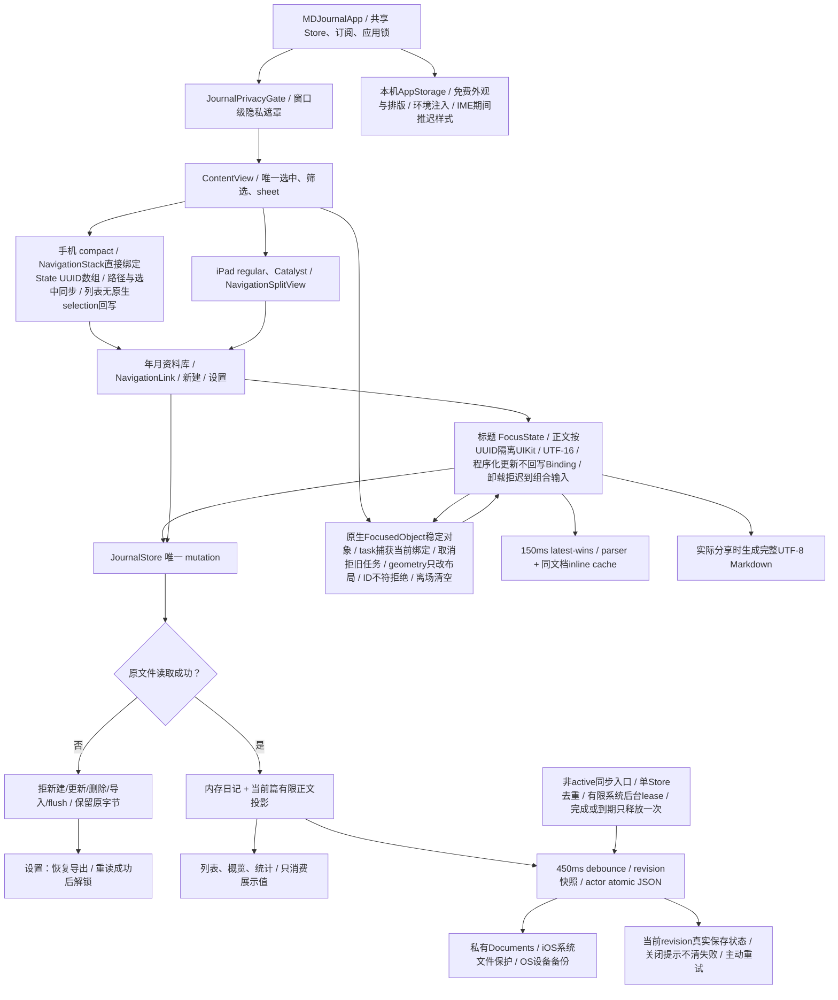
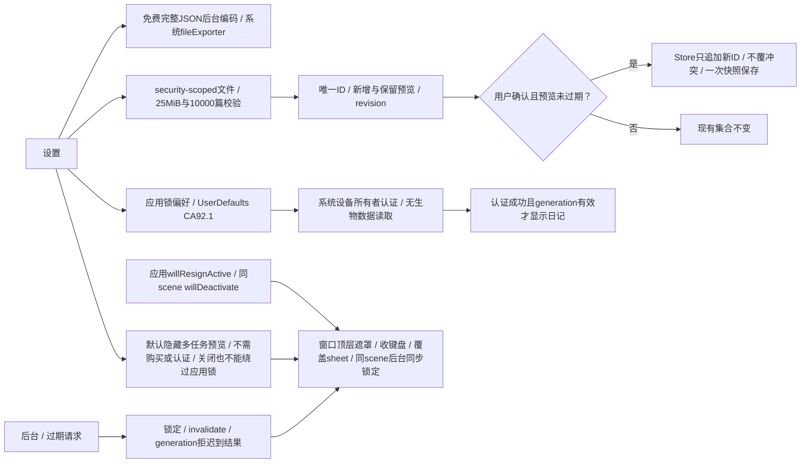
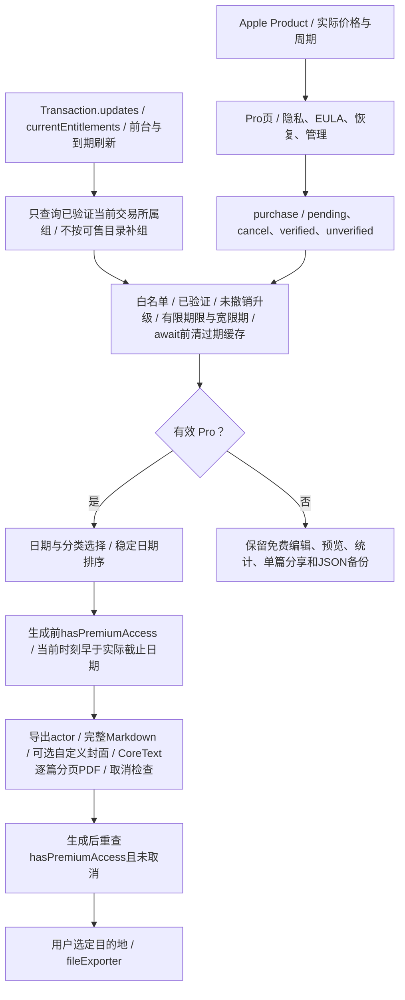
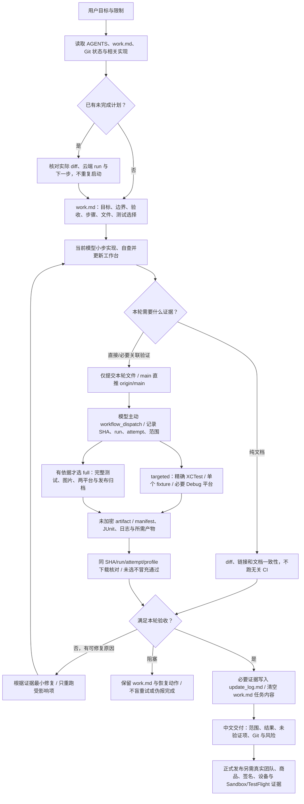

# 项目流程图

## 当前模块与状态边界

```mermaid
flowchart TD
  App["MDJournalApp / 共享 Store、订阅、应用锁"] --> Gate["JournalPrivacyGate / 窗口级隐私遮罩"]
  App --> Preferences["本机AppStorage / 免费外观与排版 / 环境注入 / IME期间推迟样式"]
  Gate --> Content["ContentView / 唯一选中、筛选、sheet"]
  Content --> Compact["手机 compact / NavigationStack直接绑定State UUID数组 / 路径与选中同步 / 列表无原生selection回写"]
  Content --> Regular["iPad regular、Catalyst / NavigationSplitView"]
  Compact --> Library["年月资料库 / NavigationLink / 新建 / 设置"]
  Regular --> Library
  Library --> Editor["标题 FocusState / 正文按UUID隔离UIKit / UTF-16 / 程序化更新不回写Binding / 卸载拒迟到组合输入"]
  Editor --> Mutation["JournalStore 唯一 mutation"]
  Library --> Mutation
  Mutation --> Health{"原文件读取成功？"}
  Health -- "否" --> Protect["拒新建/更新/删除/导入/flush / 保留原字节"]
  Protect --> Recovery["设置：恢复导出 / 重读成功后解锁"]
  Health -- "是" --> State["内存日记 + 当前篇有限正文投影"]
  State --> ListStats["列表、概览、统计 / 只消费展示值"]
  State --> Save["450ms debounce / revision快照 / actor atomic JSON"]
  Save --> File["私有Documents / iOS系统文件保护 / OS设备备份"]
  Save --> SaveStatus["当前revision真实保存状态 / 关闭提示不清失败 / 主动重试"]
  BackgroundSave["非active同步入口 / 单Store去重 / 有限系统后台lease / 完成或到期只释放一次"] --> Save
  Content --> Commands["原生FocusedObject稳定对象 / task捕获当前绑定 / 取消拒旧任务 / geometry只改布局 / ID不符拒绝 / 离场清空"]
  Editor --> Commands
  Commands --> Editor
  Editor --> Preview["150ms latest-wins / parser + 同文档inline cache"]
  Editor --> Share["实际分享时生成完整UTF-8 Markdown"]
```

## 备份与系统认证

```mermaid
flowchart LR
  Settings["设置"] --> Export["免费完整JSON后台编码 / 系统fileExporter"]
  Settings --> Import["security-scoped文件 / 25MiB与10000篇校验"]
  Import --> Preview["唯一ID / 新增与保留预览 / revision"]
  Preview --> Confirm{"用户确认且预览未过期？"}
  Confirm -- "是" --> Store["Store只追加新ID / 不覆冲突 / 一次快照保存"]
  Confirm -- "否" --> Keep["现有集合不变"]
  Settings --> Lock["应用锁偏好 / UserDefaults CA92.1"]
  Lock --> LA["系统设备所有者认证 / 无生物数据读取"]
  Background["后台 / 过期请求"] --> Generation["锁定 / invalidate / generation拒迟到结果"]
  Inactive["应用willResignActive / 同scene willDeactivate"] --> Shield["窗口顶层遮罩 / 收键盘 / 覆盖sheet / 同scene后台同步锁定"]
  Settings --> PreviewPrivacy["默认隐藏多任务预览 / 不需购买或认证 / 关闭也不能绕过应用锁"]
  PreviewPrivacy --> Shield
  LA --> Active["认证成功且generation有效才显示日记"]
  Generation --> Shield
```

## 订阅与高级导出

```mermaid
flowchart TD
  Products["Apple Product / 实际价格与周期"] --> Paywall["Pro页 / 隐私、EULA、恢复、管理"]
  Paywall --> Purchase["purchase / pending、cancel、verified、unverified"]
  Updates["Transaction.updates / currentEntitlements / 前台与到期刷新"] --> Groups["只查询已验证当前交易所属组 / 不按可售目录补组"]
  Groups --> Verify["白名单 / 已验证 / 未撤销升级 / 有限期限与宽限期 / await前清过期缓存"]
  Purchase --> Verify
  Verify --> Entitled{"有效 Pro？"}
  Entitled -- "是" --> Filter["日期与分类选择 / 稳定日期排序"]
  Filter --> Deadline["生成前hasPremiumAccess / 当前时刻早于实际截止日期"]
  Deadline --> Actor["导出actor / 完整Markdown / 可选自定义封面 / CoreText逐篇分页PDF / 取消检查"]
  Actor --> Recheck["生成后重查hasPremiumAccess且未取消"]
  Recheck --> Files["用户选定目的地 / fileExporter"]
  Entitled -- "否" --> Free["保留免费编辑、预览、统计、单篇分享和JSON备份"]
```

## 自主迭代与按范围云端验证

由当前模型逐步执行，默认不开子智能体；工作台负责上下文恢复，构建和运行默认只在云端。

```mermaid
flowchart TD
  User["用户目标与限制"] --> Read["读取 AGENTS、work.md、Git 状态与相关实现"]
  Read --> Recover{"已有未完成计划？"}
  Recover -- "是" --> VerifyState["核对实际 diff、云端 run 与下一步，不重复启动"]
  Recover -- "否" --> Plan["work.md：目标、边界、验收、步骤、文件、测试选择"]
  VerifyState --> Plan
  Plan --> Develop["当前模型小步实现、自查并更新工作台"]
  Develop --> Scope{"本轮需要什么证据？"}
  Scope -- "纯文档" --> Static["diff、链接和文档一致性，不跑无关 CI"]
  Scope -- "直接/必要关联验证" --> Push["仅提交本轮文件 / main 直推 origin/main"]
  Push --> Dispatch["模型主动 workflow_dispatch / 记录 SHA、run、attempt、范围"]
  Dispatch --> Targeted["targeted：精确 XCTest / 单个 fixture / 必要 Debug 平台"]
  Dispatch --> Full["有依据才选 full：完整测试、图片、两平台与发布归档"]
  Targeted --> Artifacts["未加密 artifact / manifest、JUnit、日志与所需产物"]
  Full --> Artifacts
  Artifacts --> Review["同 SHA/run/attempt/profile 下载核对 / 未选不冒充通过"]
  Static --> Accept{"满足本轮验收？"}
  Review --> Accept
  Accept -- "否，有可修复原因" --> Fix["根据证据最小修复 / 只重跑受影响项"]
  Fix --> Develop
  Accept -- "阻塞" --> Blocked["保留 work.md 与恢复动作 / 不盲重试或伪报完成"]
  Accept -- "是" --> Log["必要证据写入 update_log.md / 清空 work.md 任务内容"]
  Log --> Deliver["中文交付：范围、结果、未验证项、Git 与风险"]
  Deliver --> Publish["正式发布另需真实团队、商品、签名、设备与 Sandbox/TestFlight 证据"]
```
