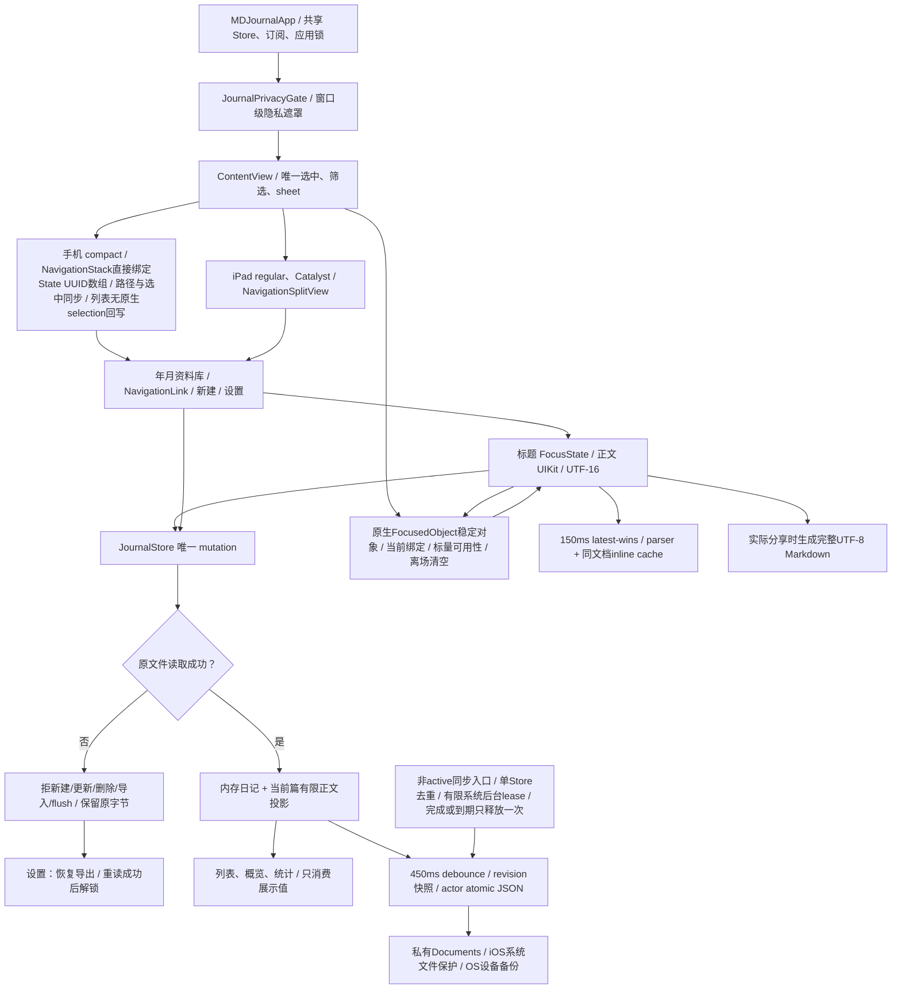
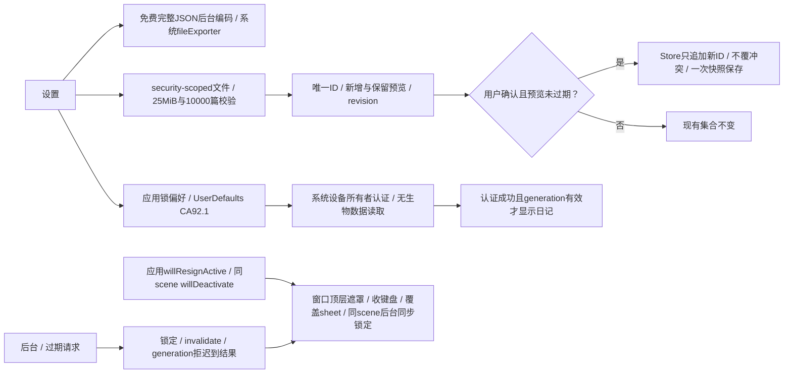
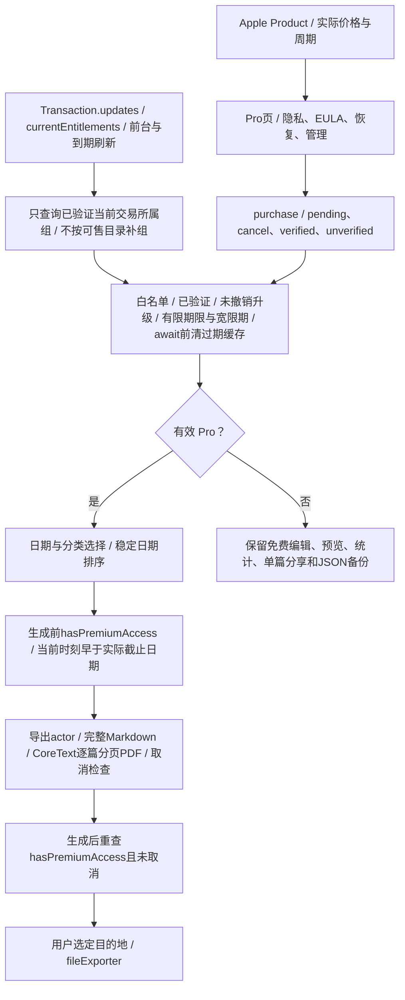
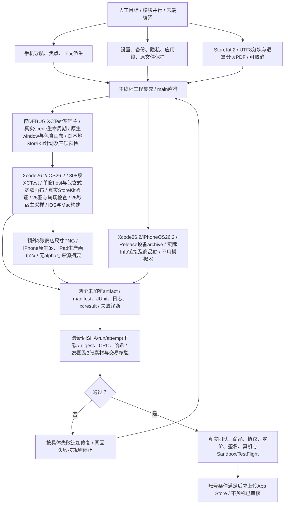

# 项目流程图

## 当前模块与状态边界

```mermaid
flowchart TD
  App["MDJournalApp / 共享 Store、订阅、应用锁"] --> Gate["JournalPrivacyGate / 窗口级隐私遮罩"]
  Gate --> Content["ContentView / 唯一选中、筛选、sheet"]
  Content --> Compact["手机 compact / NavigationStack直接绑定State UUID数组 / 路径与选中同步 / 列表无原生selection回写"]
  Content --> Regular["iPad regular、Catalyst / NavigationSplitView"]
  Compact --> Library["年月资料库 / NavigationLink / 新建 / 设置"]
  Regular --> Library
  Library --> Editor["标题 FocusState / 正文 UIKit / UTF-16"]
  Editor --> Mutation["JournalStore 唯一 mutation"]
  Library --> Mutation
  Mutation --> Health{"原文件读取成功？"}
  Health -- "否" --> Protect["拒新建/更新/删除/导入/flush / 保留原字节"]
  Protect --> Recovery["设置：恢复导出 / 重读成功后解锁"]
  Health -- "是" --> State["内存日记 + 当前篇有限正文投影"]
  State --> ListStats["列表、概览、统计 / 只消费展示值"]
  State --> Save["450ms debounce / revision快照 / actor atomic JSON"]
  Save --> File["私有Documents / iOS系统文件保护 / OS设备备份"]
  BackgroundSave["非active同步入口 / 单Store去重 / 有限系统后台lease / 完成或到期只释放一次"] --> Save
  Content --> Commands["原生FocusedObject稳定对象 / 当前绑定 / 标量可用性 / 离场清空"]
  Editor --> Commands
  Commands --> Editor
  Editor --> Preview["150ms latest-wins / parser + 同文档inline cache"]
  Editor --> Share["实际分享时生成完整UTF-8 Markdown"]
```

## 备份与系统认证

```mermaid
flowchart LR
  Settings["设置"] --> Export["免费完整JSON后台编码 / 系统fileExporter"]
  Settings --> Import["security-scoped文件 / 25MiB与10000篇校验"]
  Import --> Preview["唯一ID / 新增与保留预览 / revision"]
  Preview --> Confirm{"用户确认且预览未过期？"}
  Confirm -- "是" --> Store["Store只追加新ID / 不覆冲突 / 一次快照保存"]
  Confirm -- "否" --> Keep["现有集合不变"]
  Settings --> Lock["应用锁偏好 / UserDefaults CA92.1"]
  Lock --> LA["系统设备所有者认证 / 无生物数据读取"]
  Background["后台 / 过期请求"] --> Generation["锁定 / invalidate / generation拒迟到结果"]
  Inactive["应用willResignActive / 同scene willDeactivate"] --> Shield["窗口顶层遮罩 / 收键盘 / 覆盖sheet / 同scene后台同步锁定"]
  LA --> Active["认证成功且generation有效才显示日记"]
  Generation --> Shield
```

## 订阅与高级导出

```mermaid
flowchart TD
  Products["Apple Product / 实际价格与周期"] --> Paywall["Pro页 / 隐私、EULA、恢复、管理"]
  Paywall --> Purchase["purchase / pending、cancel、verified、unverified"]
  Updates["Transaction.updates / currentEntitlements / 前台与到期刷新"] --> Groups["只查询已验证当前交易所属组 / 不按可售目录补组"]
  Groups --> Verify["白名单 / 已验证 / 未撤销升级 / 有限期限与宽限期 / await前清过期缓存"]
  Purchase --> Verify
  Verify --> Entitled{"有效 Pro？"}
  Entitled -- "是" --> Filter["日期与分类选择 / 稳定日期排序"]
  Filter --> Deadline["生成前hasPremiumAccess / 当前时刻早于实际截止日期"]
  Deadline --> Actor["导出actor / 完整Markdown / CoreText逐篇分页PDF / 取消检查"]
  Actor --> Recheck["生成后重查hasPremiumAccess且未取消"]
  Recheck --> Files["用户选定目的地 / fileExporter"]
  Entitled -- "否" --> Free["保留免费编辑、预览、统计、单篇分享和JSON备份"]
```

## 当前并行实施与云端验证

用户选择按板块并行，覆盖旧的 A→B→C 串行轮转。功能与发布 archive 两个云端 job 对应同一提交。

```mermaid
flowchart TD
  User["人工目标 / 模块并行 / 云端编译"] --> Mobile["手机导航、焦点、长文派生"]
  User --> Safety["设置、备份、隐私、应用锁、原文件保护"]
  User --> Pro["StoreKit 2 / UTF8分块与逐篇分页PDF / 可取消"]
  Mobile --> Integrate["主线程工程集成 / main直推"]
  Safety --> Integrate
  Pro --> Integrate
  Integrate --> TestHost["仅DEBUG XCTest空宿主 / 真实scene生命周期 / 原生window与包含画布 / CI本地StoreKit计划及三项预检"]
  TestHost --> Regression["Xcode26.2/iOS26.2 / 308项XCTest / 单窗host与包含式宽窄画布 / 真实StoreKit验证 / 25图与转场检查 / 25秒宿主采样 / iOS与Mac构建"]
  Integrate --> Archive["Xcode26.2/iPhoneOS26.2 / Release设备archive / 实际Info链接及商品ID / 不用模拟器"]
  Regression --> Results["两个未加密artifact / manifest、JUnit、日志、xcresult / 失败诊断"]
  Archive --> Results
  Regression --> StoreImages["额外3张商店尺寸PNG / iPhone原生3x、iPad生产画布2x / 无alpha与来源摘要"]
  StoreImages --> Results
  Results --> Review["最新同SHA/run/attempt下载 / digest、CRC、哈希 / 25图及3张素材与交易核验"]
  Review --> Gate{"通过？"}
  Gate -- "否" --> Fix["按具体失败追加修复 / 同因失败按规则停止"]
  Fix --> Integrate
  Gate -- "是" --> Account["真实团队、商品、协议、定价、签名、真机与Sandbox/TestFlight"]
  Account --> Upload["账号条件满足后才上传App Store / 不预称已审核"]
```
